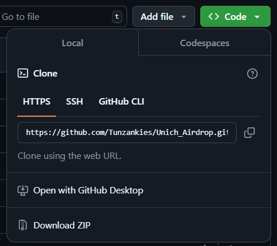

# 🚀 UNICH TOOL - HƯỚNG DẪN SỬ DỤNG 🚀


## 🔥 Giới Thiệu
**Uni-CH Tool** là công cụ hỗ trợ tự động **đăng ký tài khoản**, **treo tài khoản** và **làm nhiệm vụ** một cách nhanh chóng và hiệu quả. Hướng dẫn này sẽ giúp bạn thiết lập và chạy tool một cách chính xác.

---
## 🛠️ Cài Đặt & Chuẩn Bị

### 🔗 **Tải & Cài Đặt Tool**

1. Truy cập GitHub và tải tool:
   - Mở GitHub repo: [Unich Tool](https://github.com/Tunzankies/Unich_Airdrop)
   - Nhấn **Code** > **Download ZIP**

2. Giải nén file ZIP vừa tải về máy.
3. Mở thư mục chứa tool và tiến hành cài đặt theo hướng dẫn dưới.

---

## ⚙️ Cấu Hình (config.json)
### 🔹 **Chạy Treo Tài Khoản**
```json
{
    "numberThread": 25, 
    "autoMining": true, 
    "checkProxy": true, 
    "autoTasks": true, 
    "autoReg": false, 
    "getToken": false,
    "checkToken": false, 
    "refCode": "HRTBV9", 
    "CAPMONSTER_API_KEY": "your_api_key"
}
```
📌 **Lưu ý:**
- `numberThread`: Nên đặt từ **20 - 25** luồng để tối ưu hiệu suất.
- `autoMining`: **true** (bật chế độ farming tự động).
- `autoTasks`: **true** (tự động làm nhiệm vụ).
- `checkProxy`: **true** (kiểm tra proxy trước khi chạy).
- `autoReg`: **false** (không tự động đăng ký tài khoản).
- `getToken`: **false** (Lấy lại token thì token cũ hết hạn).
- **Thêm đầy đủ** `account.txt`, `proxy.txt` trước khi chạy.

### 🔹 **Chạy Đăng Ký Tài Khoản**
```json
{
    "numberThread": 10, 
    "autoMining": false, 
    "autoTasks": false, 
    "autoReg": true, 
    "getToken": false,
    "checkToken": false, 
    "refCode": "HRTBV9", 
    "CAPMONSTER_API_KEY": "your_api_key"
}
```
📌 **Lưu ý:**
- `numberThread`: **10** (Tránh spam OTP dẫn đến lỗi khi đăng ký).
- `autoReg`: **true** (Bật chế độ tự động đăng ký tài khoản).
- `autoTasks` & `autoMining`: **false** (Không làm nhiệm vụ hay farming khi đăng ký).
- `getToken`: **true** (Khi nào cả refresh Token và token hết hạn thì bật cái này lên).
- **Thêm đầy đủ** `hotmail.txt`, `proxy.txt` trước khi chạy.

📍 **Giải thích các giá trị cấu hình:**
- `true` = bật
- `false` = tắt

---

## 📂 Các File Cần Điều Chỉnh
### 📜 **hotmail.txt**
📌 **Định dạng:**
```
email|password|refresh_token|client_id
```
➡ Mỗi email một dòng, **không xoá mail** khi chạy tasks.

### 📜 **proxy.txt**
📌 **Định dạng:**
```
ip:port:username:password
```
➡ Mỗi proxy một dòng.

### 📜 **account.txt**
📌 **Định dạng:**
```
username|password
```
➡ Mỗi account một dòng (sau khi đăng ký thành công, lưu `email|password`).

### 📜 **Các File Không Cần Chỉnh Sửa**
- `token.txt` ❌
- `refreshToken.txt` ❌
- `tasks_status.json` ❌

---

## 🖥️ Hướng Dẫn Chạy Tool
### 💻 **Windows**
1. Chỉnh sửa `config.json` theo nhu cầu.
2. Thêm đầy đủ `hotmail.txt`, `account.txt`, `proxy.txt`.
3. Chạy tool bằng cách mở `unich.exe`.

### 🐧 **Linux**
1. Chỉnh sửa `config.json` theo nhu cầu.
2. Thêm đầy đủ `hotmail.txt`, `account.txt`, `proxy.txt`.
3. Chạy tool bằng lệnh:
   ```bash
   ./unich
   ```

---

## 🔑 Lưu Ý Về Token
- Sau khi đăng nhập, tool sẽ tự động lưu **token** và **refresh_token** vào file `token.txt` và `refreshToken.txt`.
- **Không cần chỉnh sửa** hai file này.
- Khi **token** hết hạn thì copy **refresh_token.txt** bỏ vào file `token.txt`
- Nếu mà **token** + **refresh_token** cũng hết hạn thì bật `getToken: true` lên để lấy token mới ( nhớ xoá dữ liệu file **token** và **refresh_token**)

---

## 📜 Bản Quyền
© 2025 Tunzankies. Mọi quyền được bảo lưu.

---

## 🎯 Kết Luận
Tool Unich giúp bạn **tự động hóa** quá trình **đăng ký, treo tài khoản và làm nhiệm vụ** một cách nhanh chóng. Hãy đảm bảo bạn thiết lập đúng cấu hình trước khi chạy để tránh lỗi.

💡 **Chúc bạn thành công! 🚀**